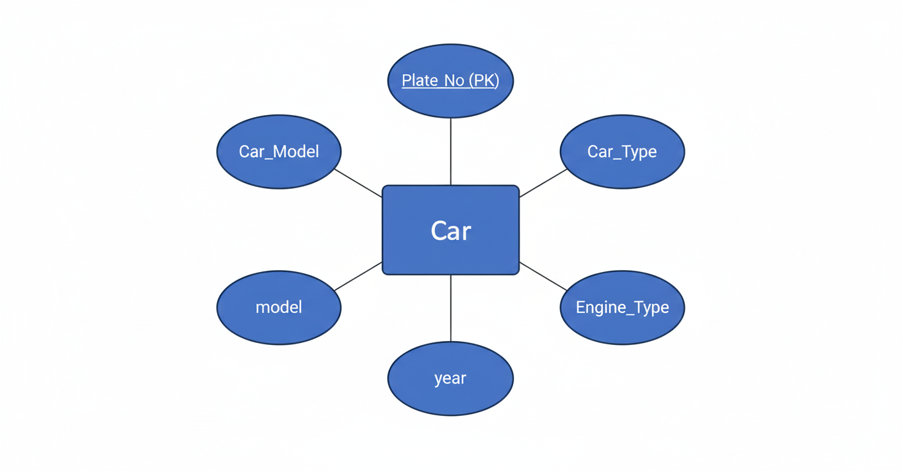

# Ex02 Django ORM Web Application
## Date: 22/09/2025

## AIM
To develop a Django application to store and retrieve data from Car Inventory Database using Object Relational Mapping(ORM).

## ENTITY RELATIONSHIP DIAGRAM

## DESIGN STEPS

### STEP 1:
Clone the problem from GitHub

### STEP 2:
Create a new app in Django project

### STEP 3:
Enter the code for admin.py and models.py

### STEP 4:
Execute Django admin and create details for 10 books

## PROGRAM

models.py

'''
from django.db import models
from django.contrib import admin
class  Car_Inventory(models.Model):
    Plate_No = models.CharField(max_length=20, primary_key=True)
    Car_Model = models.CharField(max_length=50)
    Car_Type = models.CharField(max_length=20)
    Mileage = models.IntegerField( )
    Engine_Type = models.CharField(max_length=15)
    Make_Date = models.DateField( )
class Car_InventoryAdmin(admin.ModelAdmin):
    list_display = ('Plate_No', 'Car_Model', 'Car_Type', 'Mileage', 'Engine_Type', 'Make_Date')
'''

admin.py

'''
from django.contrib import admin
from .models import Car_Inventory,Car_InventoryAdmin
admin.site.register(Car_Inventory,Car_InventoryAdmin)
'''

## OUTPUT

Include the screenshot of your admin page.

## RESULT
Thus the program for creating a database using ORM hass been executed successfully
